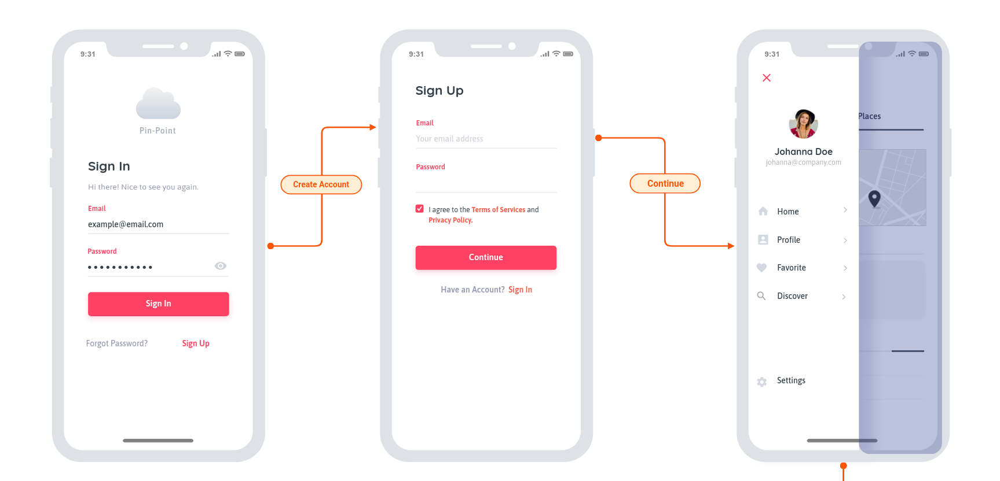
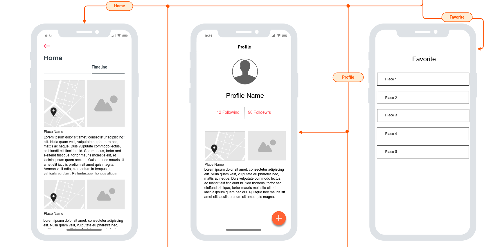
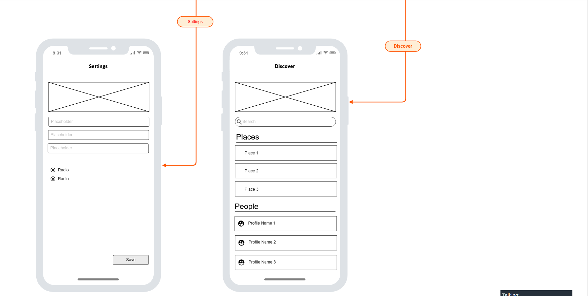

# Pin-Point
to save and share diary locations notes

## Members Names:

1. Humam Mkhzoumi
2. Hala Khamayseh
3. Ayyoub Alkeyyam
4. Baraa Alosaily
5. Abdullah Alabed

## Project description:

What is PinPoint :An android application project that allows you to share the locations you visit with adding a description and other people can start following you and can have an idea about these places from the people who visit it already.

## Problem Domain:

1. Give you the ability to save your visited places as a diary.
2. Make it easier for people to share their experience about places.
3. Make it easier for people to explore new places based on other people's opinion.

## User Stories:

### Feature1:
 As a user, I want a personnel accounts ,I can login into with username and password.
### Feature2:
 As a user, I want to be able to save the locations I visited with a feedback or images.
### Feature3:
 As a user, I want to search  for specific place and see it's description.
### Feature4:
 As a user, I want to be able to add other users as freind.

## Wireframe

